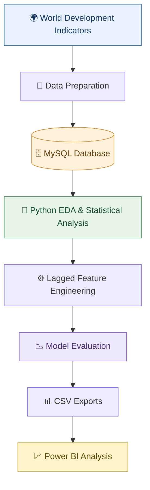

# 🌍 Global Development Analytics & GDP per Capita Prediction

<p align="center">
  
  
  
  
  
</p>

## 📌 Project Overview

This project explores country-level development patterns using selected **World Development Indicators (WDI)** from 2010–2024. It examines how population growth, life expectancy, internet usage, unemployment, and exports as a percentage of GDP relate to GDP per capita, then compares approaches for predicting next-year GDP per capita.

| 🎯 Target | 🛠️ Tools | 🌐 Unit of Analysis |
|---|---|---|
| GDP per capita (constant 2015 US$) | Python, Pandas, NumPy, Matplotlib, Seaborn, SciPy, scikit-learn, MySQL, Power BI | Country/economy-year observations |

## 🔎 Questions Explored

- 📈 How does GDP per capita vary across economies and years?
- 🌐 How are the five selected development indicators associated with GDP per capita?
- 🤖 How do indicators-only models compare with a previous-year GDP baseline and models that include lagged GDP?
- 📊 What are the country-level prediction gaps, and how can the outputs support Power BI analysis?

## 🧭 Project Workflow



## 🧰 Technologies Used

| Technology | Purpose |
|---|---|
| 🐍 Python | Data analysis and modelling |
| 🧮 Pandas & NumPy | Data preparation and numerical operations |
| 📊 Matplotlib & Seaborn | Data visualization |
| 📐 SciPy | Statistical analysis |
| 🤖 scikit-learn | Regression models and evaluation |
| 🗄️ MySQL | Data storage and SQL analysis |
| 📈 Power BI | Interactive reporting and visualization |

## 🧠 Models & Evaluation

The project compares a persistence baseline, Linear Regression, and Random Forest models.

| Approach | MAE (constant 2015 US$) | R² |
|---|---:|---:|
| Previous-year GDP baseline | 398.85 | 0.994 |
| Linear Regression — indicators only | 13,027.97 | 0.428 |
| Random Forest — indicators only | 5,550.14 | 0.825 |
| Linear Regression — indicators + lagged GDP | 376.84 | 0.995 |
| Random Forest — indicators + lagged GDP | 496.79 | 0.994 |

> **Interpretation:** These scores are from a previous notebook run and should be revalidated before being treated as final. The strong full-model scores are substantially influenced by previous-year GDP per capita. The indicators-only results provide a separate view of predictive performance. Correlation and prediction do not establish causation.

## 📂 Repository Structure

```text
global-development-analytics/
│
├── Global_Development_Analytics.ipynb
├── Project_2_WDI_Clean_Six_Indicators_2010_2024.xlsx
├── requirements.txt
├── README.md
└── sql/
    └── global_development_analytics.sql
```

## 🚀 Setup & Reproducibility

**Prerequisites:** Python, Jupyter Notebook, and a local MySQL installation.

1. Install the required Python packages:

   ```bash
   pip install -r requirements.txt
   ```

2. Set up the MySQL database named `global_development`.
3. Import and prepare the `development_data` table with the expected columns.
4. Open the notebook and run the cells in order.
5. Review the exported CSV files for further analysis in Power BI.

⚠️ **Database note:** The notebook uses a local MySQL database that is not included in this repository. The project is not fully reproducible until the required table is prepared. The notebook requests the database password at runtime rather than storing it in the file.

## 🗃️ SQL Analysis

The SQL script includes queries intended for:

- Record counts and year coverage
- Country/economy counts
- Missing-value and duplicate checks
- Indicator ranges
- GDP per capita rankings
- Comparisons across 2010–2024

Run the script against a test database first and validate the imported row counts and query results.

## 📚 Data Sources

- [World Bank — World Development Indicators](https://databank.worldbank.org/source/world-development-indicators)
- [DataHub — World Development Indicators](https://datahub.io/core/world-development-indicators)

Confirm the exact source file, indicator codes, download date, and applicable data license before publishing a formal data citation.

## ⚠️ Limitations

- Coverage depends on data availability and missing-value handling.
- Model scores depend on the prepared dataset and train/test split.
- Strong performance with lagged GDP does not mean the five development indicators alone explain GDP per capita accurately.
- Predictions are estimates, not official forecasts.
- Observational relationships should not be interpreted as causal effects.

---

<p align="center">
  <b>📊 Exploring global development through data, statistics, and analytics.</b>
</p>
