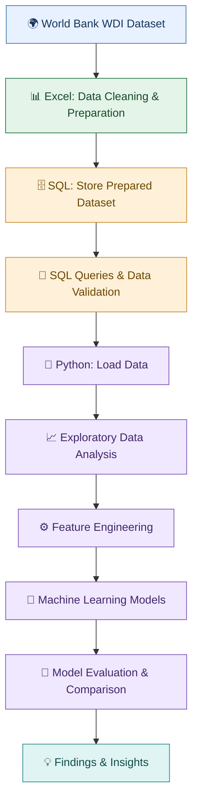

# 🌍 Global Development Analytics & GDP per Capita Prediction


## 📌 Project Overview

This project explores global development indicators and their relationship with GDP per capita across countries and economies from **2010 to 2024**, using World Development Indicators (WDI) data from the World Bank.

The project follows a data analytics workflow, beginning with data preparation in Excel, continuing with SQL-based data storage and querying, and progressing to exploratory data analysis (EDA) and machine learning in Python.

The objective is to understand development trends, examine relationships between economic and social indicators, and evaluate models for predicting GDP per capita.

## 🎯 Project Objectives

- Clean and prepare World Bank development data using Excel.
- Store and query the prepared dataset using SQL.
- Explore trends and relationships between GDP per capita and development indicators.
- Engineer features for predictive modelling.
- Train and evaluate machine learning models.
- Compare model performance and interpret the results.

## 🔄 Project Workflow



## 🛠️ Tools & Technologies

| Tool | Purpose |
|---|---|
| Microsoft Excel | Data cleaning, indicator selection and preparation |
| MySQL / SQL | Data storage, querying and validation |
| Python | Data analysis and machine learning |
| Pandas & NumPy | Data manipulation and numerical operations |
| Matplotlib & Seaborn | Data visualization |
| Scikit-learn | Machine learning and model evaluation |
| Jupyter Notebook | Development and documentation |

## 📂 Dataset

**Source:** [World Bank — World Development Indicators](https://databank.worldbank.org/source/world-development-indicators)

The project uses development indicators covering the period **2010–2024**.

The selected variables include:

- **GDP per capita:** GDP per capita (constant 2015 US$), used as the prediction target.
- **Population growth:** Annual population growth rate.
- **Life expectancy:** Life expectancy at birth.
- **Internet usage:** Individuals using the internet (% of population).
- **Unemployment:** Unemployment rate.
- **Exports:** Exports of goods and services (% of GDP).

The prepared dataset is used for SQL analysis and subsequent Python-based modelling.

## 1️⃣ Excel — Data Preparation

The first stage involved preparing the World Bank dataset for analysis.

Key activities:
- Selected the required development indicators.
- Filtered the relevant years from 2010 to 2024.
- Cleaned and organized the data into an analytical structure.
- Reviewed missing values and duplicate records.
- Prepared the cleaned dataset for SQL storage.

**Output:** A structured dataset ready for database storage and analysis.

## 2️⃣ SQL — Data Storage & Queries

The second stage involved storing the prepared dataset in a relational database and using SQL queries to inspect and analyze the data.

Key activities:
- Created the project database and analytical table.
- Imported the prepared development dataset.
- Examined country and year coverage.
- Checked missing values and duplicate records.
- Queried indicator ranges and GDP per capita rankings.
- Compared development indicators across countries and years.

**Output:** A database containing the prepared data and SQL queries for analytical exploration.

The SQL script is available in the `sql/` directory.

## 3️⃣ Python — EDA & Machine Learning

The third stage focused on exploratory analysis, feature engineering and predictive modelling using Python in Jupyter Notebook.

### Exploratory Data Analysis (EDA)

- Examined the distribution of GDP per capita.
- Explored relationships between GDP per capita and selected indicators.
- Investigated patterns across countries and years.
- Visualized trends and relationships using charts.

### Feature Engineering

- Prepared model features from the selected development indicators.
- Created lagged GDP per capita features to incorporate previous-year information.
- Prepared the data for model training and evaluation.

### Machine Learning Models

The project compares different approaches to GDP per capita prediction:

- Previous-year GDP baseline.
- Linear Regression.
- Random Forest Regressor.

Models using development indicators alone are evaluated separately from models that also include lagged GDP per capita.

### Model Evaluation

The models are assessed using:

- **Mean Absolute Error (MAE):** Measures the average absolute prediction error.
- **R² score:** Measures the proportion of variance explained by the model.

The previous-year GDP baseline is important because GDP per capita often changes gradually over time. Models that include lagged GDP can perform substantially better than models relying only on the selected development indicators.

*Note: Model scores should be confirmed by rerunning the notebook before being presented as final results.*

## 📊 Key Analytical Focus

The project investigates the following questions:

1. How has GDP per capita changed across countries from 2010 to 2024?
2. How are population growth, life expectancy, internet usage, unemployment and exports associated with GDP per capita?
3. How does predictive performance differ between development-indicator-only models and models that use previous-year GDP?
4. Does adding lagged GDP improve predictive accuracy compared with using development indicators alone?

## 📁 Repository Structure

```text
global-development-analytics/
│
├── Global_Development_Analytics.ipynb
├── Project_2_WDI_Clean_Six_Indicators_2010_2024.xlsx
├── requirements.txt
├── README.md
│
└── sql/
    └── global_development_analytics.sql
```

## 🚀 How to Run the Project

### Prerequisites

- Python 3.x
- Jupyter Notebook
- MySQL Server
- Microsoft Excel or a compatible spreadsheet application

### Step 1: Download the Repository

Clone or download this GitHub repository to your computer.

### Step 2: Install Python Dependencies

Run the following command in your terminal:

```bash
pip install -r requirements.txt
```

### Step 3: Prepare the Data

Open the cleaned Excel dataset and review the prepared indicators and year coverage.

### Step 4: Set Up the SQL Database

Open the SQL script in the `sql/` directory, configure your MySQL connection, and execute the script according to its instructions.

Update the notebook's database connection settings to match your local MySQL configuration. Do not commit passwords or other credentials to GitHub.

### Step 5: Run the Python Notebook

Open `Global_Development_Analytics.ipynb` in Jupyter Notebook and execute the cells in order.

Ensure the dataset path and database connection settings match your local environment.

## ⚠️ Limitations

- The completeness of development indicators varies across countries and years.
- GDP per capita predictions depend on the features and historical information available.
- Strong predictive performance does not establish that the selected indicators cause changes in GDP per capita.
- Models using lagged GDP may benefit from the persistence of GDP over time; their scores should not be compared with indicator-only models without explaining this difference.
- Results depend on the data preparation, train-test split and evaluation methodology.

## 📚 Data Source & References

- [World Bank — World Development Indicators](https://databank.worldbank.org/source/world-development-indicators)
- [World Bank Data API](https://datahelpdesk.worldbank.org/knowledgebase/topics/125589-developer-information)

## 👩‍💻 Project Summary

This project demonstrates an end-to-end analytical workflow combining **Excel-based data preparation, SQL-based data management and querying, and Python-based exploratory analysis and machine learning**.

It applies data analytics techniques to international development data to explore economic patterns and evaluate GDP per capita prediction approaches.
