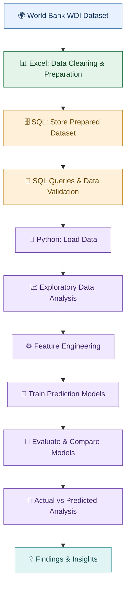

# 🌍 Global Development Analytics & GDP per Capita Prediction


An end-to-end data analytics and machine learning project exploring global development indicators and predicting GDP per capita using World Bank data from **2010–2024**.

## 📌 Project Overview

This project investigates how selected economic, demographic, digital, labour-market and trade-related indicators are associated with GDP per capita across countries and economies.

Using the World Bank's World Development Indicators (WDI) dataset, the project follows three main stages:

1. **Excel:** Data selection, cleaning and preparation.
2. **SQL:** Data storage, querying and validation.
3. **Python:** Exploratory data analysis (EDA), feature engineering, machine learning and prediction analysis.

The predictive component examines whether historical development indicators can estimate GDP per capita in the following year and whether including previous-year GDP improves model performance.

## 🎯 Project Objectives

- Prepare a structured dataset of development indicators.
- Store and analyze the prepared data using SQL.
- Explore GDP per capita trends and relationships with development indicators.
- Build predictive models using historical data.
- Compare a baseline, Linear Regression and Random Forest.
- Evaluate the predictive contribution of development indicators separately from previous-year GDP.
- Compare actual and predicted GDP per capita to identify prediction gaps.

## 🔄 Project Workflow



## 🛠️ Tools & Technologies

| Tool | Purpose |
|---|---|
| Microsoft Excel | Data selection, cleaning and preparation |
| MySQL / SQL | Data storage, querying and validation |
| Python | Data analysis and predictive modelling |
| Pandas | Data manipulation and analysis |
| NumPy | Numerical operations |
| Matplotlib & Seaborn | Data visualization |
| Scikit-learn | Model training and evaluation |
| Jupyter Notebook | Analysis and project documentation |

## 📂 Dataset

**Source:** [World Bank — World Development Indicators](https://databank.worldbank.org/source/world-development-indicators)

**Analysis period:** 2010–2024

**Unit of analysis:** Country-year observations, representing a country or economy in a particular year.

### Selected Indicators

| Indicator | Role in the analysis |
|---|---|
| GDP per capita (constant 2015 US$) | Prediction target |
| Population growth | Development indicator |
| Life expectancy at birth | Development indicator |
| Internet usage (% of population) | Development indicator |
| Unemployment | Development indicator |
| Exports of goods and services (% of GDP) | Development indicator |

The analysis focuses on the five selected development indicators and GDP per capita. These variables provide a limited view of development and do not capture every factor influencing national economic outcomes.

## 1️⃣ Excel — Data Preparation

The first stage involved preparing the World Bank data for analysis.

### Key activities

- Selected the required indicators.
- Filtered the relevant period, 2010–2024.
- Cleaned and organized the dataset.
- Reviewed missing values and duplicate records.
- Prepared the structured dataset for SQL storage.

**Output:** A cleaned dataset ready for database storage and subsequent analysis.

## 2️⃣ SQL — Data Storage & Queries

The second stage involved storing the prepared dataset in a relational database and using SQL to inspect and analyze the data.

### Key activities

- Created the project database and analytical table.
- Imported the prepared development dataset.
- Examined country and year coverage.
- Checked missing values and duplicate records.
- Queried indicator ranges and GDP per capita rankings.
- Compared development indicators across countries and years.

**Output:** A database and a set of SQL queries supporting data validation and analytical exploration.

The SQL script is stored in the `sql/` directory.

## 3️⃣ Python — EDA & Machine Learning

The third stage focused on exploratory analysis, feature engineering and GDP per capita prediction using Python in Jupyter Notebook.

### 📈 Exploratory Data Analysis

The analysis explored:

- Differences in GDP per capita across countries and years.
- Relationships between GDP per capita and the selected development indicators.
- Historical development patterns and indicator distributions.
- Actual versus predicted GDP per capita.

These analyses help describe patterns in the data but do not establish causal relationships.

### ⚙️ Feature Engineering & Prediction Setup

The predictive question was:

> Can a country's previous-year GDP per capita and development indicators help predict its GDP per capita in the following year?

The project compared three approaches:

1. **Previous-Year GDP Baseline:** Uses the previous year's GDP per capita as the prediction for the following year.
2. **Indicators-Only Models:** Use the five lagged development indicators without GDP per capita as a predictor.
3. **Full Models:** Combine the five development indicators with previous-year GDP per capita.

The notebook describes a chronological evaluation approach, using historical observations from **2011–2022** for training and later observations from **2023–2024** for testing.

### 🤖 Models Evaluated

- **Linear Regression:** Models relationships between input variables and GDP per capita using a linear function.
- **Random Forest Regressor:** Combines multiple decision trees to model potentially more complex patterns.
- **Previous-Year GDP Baseline:** Provides a simple benchmark against which machine learning models can be compared.

The baseline is not a machine learning model; it is included to determine whether more complex models improve on simply carrying forward the previous year's GDP per capita.

## 📊 Machine Learning Results

The following performance values are recorded in the exported notebook.

| Model | MAE | RMSE | R² |
|---|---:|---:|---:|
| Previous-Year GDP Baseline | 398.85 | 1,584.59 | 0.994 |
| Linear Regression — Indicators Only | 13,027.97 | 15,936.26 | 0.428 |
| Random Forest — Indicators Only | 5,550.14 | 8,820.87 | 0.825 |
| Linear Regression — Indicators + Previous GDP | **376.84** | 1,555.56 | **0.995** |
| Random Forest — Indicators + Previous GDP | 496.79 | 1,592.21 | 0.994 |

*MAE and RMSE are measured in constant 2015 US dollars per capita. These are recorded notebook results and should be reconfirmed by rerunning the final notebook before being treated as verified final results.*

### 📐 Evaluation Metrics

- **MAE (Mean Absolute Error):** Average absolute difference between actual and predicted values. Lower is better.
- **RMSE (Root Mean Squared Error):** Measures prediction error while penalizing larger errors more heavily. Lower is better.
- **R²:** Measures how well predictions account for variation in the target relative to a mean-based reference. Higher is generally better.

### 🏆 What Did the Models Find?

**1. Random Forest performed better with development indicators alone.**

Random Forest achieved an R² of **0.825**, compared with **0.428** for Linear Regression. It also had a lower MAE, suggesting that it captured more useful predictive patterns from the five selected indicators in this evaluation.

**2. Previous-year GDP substantially improved prediction performance.**

When previous-year GDP per capita was included, the recorded R² increased to **0.995** for Linear Regression and **0.994** for Random Forest.

This indicates that historical GDP per capita carries substantial information about the following year's value.

**3. Linear Regression with previous-year GDP achieved the strongest recorded overall metrics.**

It achieved the lowest MAE, **376.84**, and the highest R², **0.995**, among the approaches compared. Its recorded results were slightly better than the previous-year GDP baseline on the listed metrics.

**4. The five development indicators alone were less accurate.**

Both indicators-only models had larger errors than the models that also used previous-year GDP. This shows why it is important to evaluate the selected development indicators separately from GDP's year-to-year persistence.

**5. More complex models do not automatically perform best.**

Random Forest performed better than Linear Regression when using the five indicators alone, but Linear Regression performed best in the recorded full-model comparison. The best-performing model depends on the features provided and the evaluation setup.

## 🇮🇳 Example: India GDP per Capita in 2024

The notebook records the following actual-versus-predicted comparison for India in 2024:

| Measure | GDP per capita |
|---|---:|
| Actual value | $2,366.83 |
| Linear Regression prediction | $2,429.08 |
| Random Forest prediction | $2,300.03 |

These values illustrate how the model estimates can be compared with an observed country-year value. The predictions should be interpreted in the context of the model's inputs and evaluation process, not as official economic forecasts.

## 🔍 Prediction Gap Analysis

The project also compares predicted GDP per capita with actual values to identify observations where the model's estimate differs from the recorded value.

These prediction gaps can help identify country-year observations for further investigation. However, a gap alone does not explain why the difference occurred. Additional economic, demographic, policy and country-specific information would be needed to investigate possible explanations.

## 💡 Overall Key Findings

The main findings from the project are:

- GDP per capita varies substantially across countries and over time.
- The five selected development indicators contain useful predictive information, although their performance differs by model.
- Random Forest outperformed Linear Regression when only the five development indicators were used.
- Including previous-year GDP greatly improved the recorded model performance.
- Linear Regression with previous-year GDP achieved the strongest recorded overall metrics.
- Actual-versus-predicted comparisons provide a starting point for identifying observations that merit further analysis.

**Main takeaway:** Model performance depends on the information supplied to the model. Comparing indicators-only models with models that use historical GDP helps distinguish the predictive information in the selected development indicators from the persistence of GDP over time.

## 📁 Repository Structure

```text
global-development-analytics/
│
├── Global_Development_Analytics.ipynb
├── Project_2_WDI_Clean_Six_Indicators_2010_2024.xlsx
├── requirements.txt
├── README.md
│
└── sql/
    └── global_development_analytics.sql
```

*Make sure the filenames and folder structure in your GitHub repository match this example.*

## 🚀 How to Run the Project

### Prerequisites

- Python 3.x
- Jupyter Notebook
- MySQL Server
- Microsoft Excel or a compatible spreadsheet application

### Step 1 — Get the Repository

Clone or download the GitHub repository to your computer.

### Step 2 — Install Dependencies

Open a terminal in the project folder and run:

```bash
pip install -r requirements.txt
```

### Step 3 — Review the Prepared Dataset

Open the cleaned Excel file and verify the indicators and year coverage.

### Step 4 — Set Up SQL

Open the SQL script in the `sql/` directory and configure it for your local MySQL setup. Run the script according to its instructions.

### Step 5 — Run the Notebook

Open `Global_Development_Analytics.ipynb` in Jupyter Notebook and execute the cells in order. Update file paths and database connection settings to match your environment.

**Security note:** Never commit database passwords, API keys or other credentials to a public GitHub repository.

## ⚠️ Limitations

- The analysis covers five selected development indicators and does not include every factor that may influence GDP per capita.
- Data availability varies across countries and years.
- GDP per capita is persistent over time, so models that include previous-year GDP can achieve high scores even when the other indicators contribute less predictive information.
- Model results depend on data preparation, feature construction and the train-test procedure.
- The recorded metrics and India example should be reconfirmed against the final notebook before publication.
- Predictive relationships do not establish causation.
- Prediction gaps identify differences between actual and estimated values but do not establish the reasons behind those differences.
- The results are analytical benchmarks, not official economic forecasts.

## 📚 Data Sources

- [World Bank — World Development Indicators](https://databank.worldbank.org/source/world-development-indicators)
- [World Bank Data API Documentation](https://datahelpdesk.worldbank.org/knowledgebase/topics/125589-developer-information)

## Key Findings and Practical Relevance

This project analyzes global development trends and explores how social and economic indicators relate to GDP per capita across countries from 2010 to 2024, using World Bank data. The analysis evaluates population growth, life expectancy, internet usage, unemployment, and exports as a percentage of GDP to understand their relationship with economic outcomes and assess their usefulness in GDP-per-capita prediction. Among the models using these indicators alone, Random Forest performed better than Linear Regression in the recorded evaluation results. Including previous-year GDP per capita substantially improved prediction accuracy, highlighting the importance of historical economic trends in estimating future values. These findings demonstrate how public data, SQL, Python, and machine learning can support cross-country comparisons, economic trend analysis, and data-informed research. The results may be useful to analysts, researchers, and development organizations exploring differences in economic performance. However, the project identifies predictive relationships rather than causal effects; it does not establish that any individual indicator directly causes GDP per capita to increase or decrease.

## 👩‍💻 Project Summary

This project demonstrates an end-to-end analytics workflow using **Excel, SQL, Python and machine learning** to investigate global development indicators and GDP per capita.

It progresses from data preparation and validation to exploratory analysis, predictive modelling, model comparison and interpretation of prediction gaps.

The central lesson is that machine learning results should be interpreted in context: a strong prediction score is meaningful only when the model's inputs, baseline performance and evaluation approach are understood.
